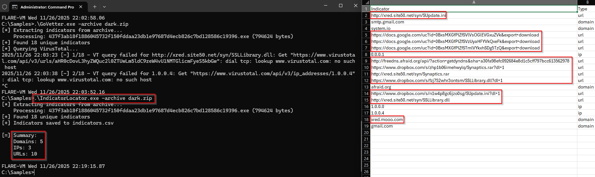
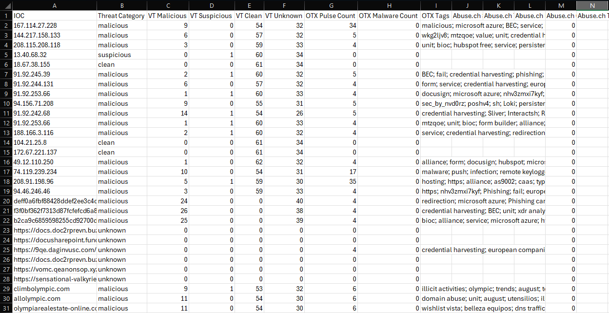
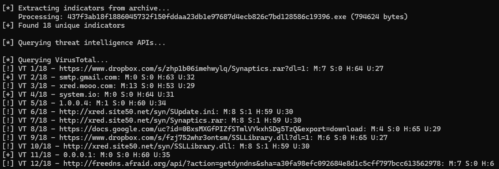
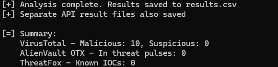

# GoVettersTools

A collection of three powerful Go-based security analysis tools for malware research and threat intelligence.

**NOTE: Each tool directory has its own README with a more detailed explanation of each tool.**

## IndicatorGocator

A simple command-line tool for extracting network-based IOCs (URLs, IP addresses, and domains) from malware samples stored in password-protected archives. 

> ⚠️ RUN IN ISOLATION - This should run in an isolated malware analysis lab!

### Features
- **Multi-format support**: ZIP, 7z, RAR, TAR, GZ, TGZ, BZ2, XZ, LZMA
- **Password-protected archives**: Uses standard malware research password "infected"
- **String extraction**: Extracts both ASCII and UTF-16LE encoded strings
- **IOC detection**: Identifies URLs, IPv4 addresses, and domains
- **Noise filtering**: Excludes private IPs, localhost, and common legitimate domains
- **CSV output**: Exports findings in an analysis-friendly format

### Example Output



### Installation

```bash
git clone https://github.com/grepstrength/GoVettersTools
cd GoVettersTools\IndicatorGocator
go build -ldflags "-H windowsgui -s -w" -o IndicatorGocator.exe
```
### BasicUsage

```bash
IndicatorGocator.exe -archive \PATH\TO\FILE.zip -output OUTPUTFILE.csv
```

## RealGoVetter

A portable GUI tool designed to leverage multiple APIs to do reputation checks on files, domains, IPs, and URLs in *BULK*. You are only limited by your VirusTotal, AlienVaultOTX, or Abuse.ch accounts' API quotas.

> ⚠️ RUN ON HOST MACHINE - This can safely run on your host machine. This only queries threat intelligence APIs and does not connect to any indicators directly.

### Features 
- **Portable deployment**: Runs as a standalone Windows executable without dependencies 
- **User-friendly interface**: Simple GUI for easy navigation and operation
- **Flexible input formats**: Accepts .CSV, XLSX, JSON, or .TXT files containing IOCs
- **Multi-IOC support**: Evaluates multiple indicator types:
  - File Hashes (MD5, SHA-1, SHA-256)
  - Domains
  - IP Addresses
  - URLs
- **Multi-API integration**: Queries VirusTotal, AlienVaultOTX, and Abuse.ch simultaneously
- **Bulk processing**: Process hundreds of IOCs limited only by your API quotas
- **Secure API key storage**: Saves API keys locally for convenience
- **Structured output**: Exports CSV reports with detailed analysis results and reputation scores

### Example Output



### Installation

```git clone https://github.com/grepstrength/GoVettersTools
cd GoVettersTools\RealGoVetter
go build -ldflags "-H windowsgui -s -w" -o RealGoVetter.exe
```
### Basic Usage

- Execute the file. 
- Input API keys.
- Select a file of IOCs.

## MalGoVetter

A command-line tool for extracting and analyzing Indicators of Compromise (IOCs) from malware samples stored in password-protected archives. MalGoVetter automatically extracts network indicators (URLs, domains, IPs) from binary files and queries multiple threat intelligence platforms to assess their reputation.

> ⚠️ RUN IN VM/CONTAINER WITH INTERNET - This should run in an internet-accessible malware analysis lab (preferably a VM or Docker container) because this needs internet access to function!

### Features
- **Automatic string extraction** from binary files (ASCII and UTF-16LE Unicode)
- **Supports multiple archive formats**: ZIP, 7z, RAR, TAR, GZ, BZ2, XZ, LZMA
- **Password-protected archives** supported (default password: `infected`)
- **Indicator types detected**:
  - URLs (HTTP/HTTPS)
  - Domain names (comprehensive TLD coverage)
  - IPv4 addresses

### Example Output





### Installation

```git clone https://github.com/grepstrength/GoVettersTools
cd GoVettersTools\MalGoVetter
go build -ldflags "-H windowsgui -s -w" -o MalGoVetter.exe
```
### Basic Usage

```bash
MalGoVetter.exe -archive \PATH\TO\FILE.zip -output OUTPUTFILE.csv
```

## Requirements

- Go 1.21 or higher
- VirusTotal API key
- AlienVaultOTX DirectConnect API key
- Threatfox (Abuse.ch) API key## Requirements

### Obtaining API Keys

| Service | Free Tier | Registration |
|---------|-----------|--------------|
| **VirusTotal** | 4 requests/minute, 500/day | [virustotal.com](https://www.virustotal.com/gui/join-us) |
| **AlienVault OTX** | Unlimited (fair use) | [otx.alienvault.com](https://otx.alienvault.com/accounts/signup/) |
| **ThreatFox** | Unlimited (fair use) | [abuse.ch Authentication Portal](https://auth.abuse.ch/) |

## License

MIT License

## Issues

❌ The Threatfox API calls are currently failing for RealGoVetter and MalGoVetter, and I'm working on fixing that. The overall scripts still work just fine with AlienVault OTX and VirusTotal, though. 